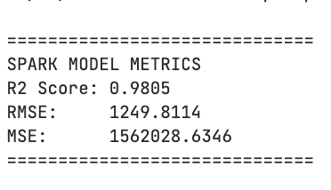
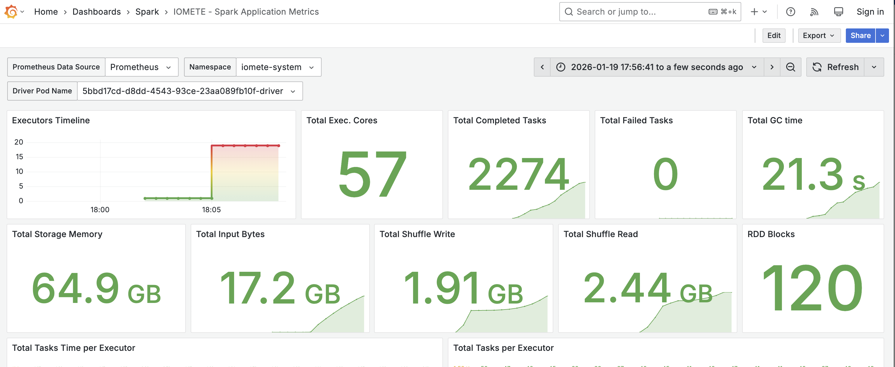
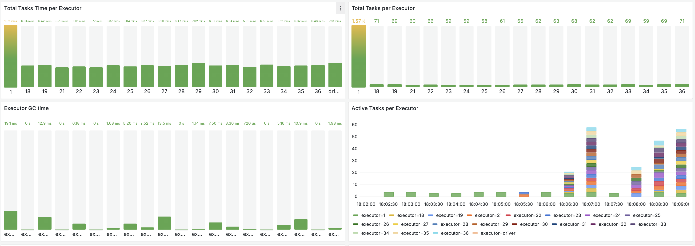
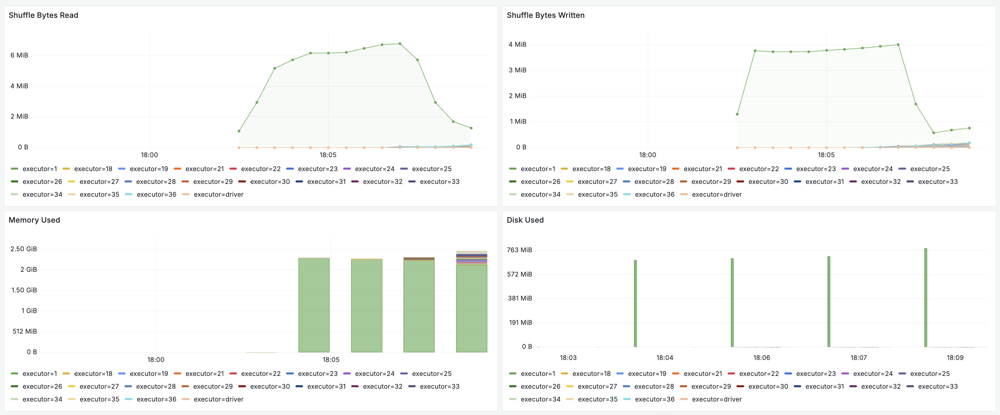
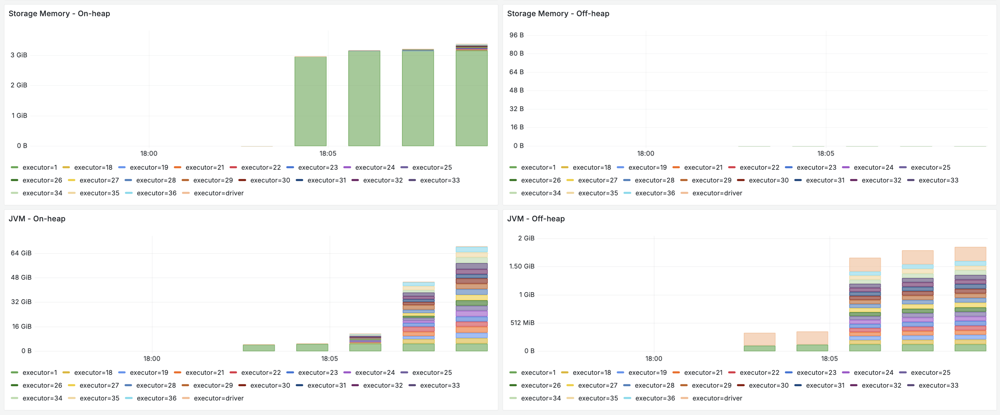

# PySpark Machine Learning on IOMETE

This repository contains a production-ready template for distributed **Machine Learning training** using PySpark on the IOMETE Lakehouse.

Repo contains a spark job that you can deploy directly to IOMETE clusters. For more details on deploying spark jobs to IOMETE, refer to documentation [here](https://iomete.com/resources/developer-guide/spark-job/getting-started/).

Unlike the setup in the documentation above that uses `virtualenv`, this one uses a custom Docker environment powered by `uv` to ensure high-performance python libraries (like `numpy`, `pandas`) are pre-installed and optimized for the Spark 3.5.x runtime.

## 🧠 ML Capabilities

The included `job.py` provides a scalable **Random Forest** pipeline that includes **Distributed Training**, i.e., training models across multiple Spark executors. It is purposefully designed to be a starting point for more complex ML workflows. You can easily extend it to include:

* Feature Engineering (e.g., OneHotEncoding, Scaling)
* Different ML Algorithms (e.g., Decision Trees, XGBoost)
* Hyperparameter Tuning (e.g., Cross-Validation, Grid Search)

---

## 📦 Environment Setup

### 1. Build Your ML Environment

This project bakes your code and dependencies into a Docker image so you don't have to install libraries at runtime.

```bash
# Clone and enter the repo
git clone https://github.com/iomete/iomete-ml-quickstart.git
cd iomete-ml-quickstart
mv .env.example .env
```

Update the `.env` file: 

```txt
# ---- Data ----
MY_BUCKET=... # S3-compatible bucket name where your data is stored
MY_CSV_FILE=... # path to your csv file in the bucket

# ---- Docker ----
IMAGE=... # your docker image name
TAG=... # your docker image tag
REGISTRY=... # your docker registry URL
```

Then, run:

```
# Build and push your custom ML image
make docker-push
```

### 2. Prepare Your Data

Ensure your training data that is in an S3-compatible bucket is available in your IOMETE Lakehouse. OR, you can use the synthetic data generation logic included in `job.py` for testing purposes.

---

## 🚀 Running the ML Job on IOMETE

Running ML training job can be submitted just like any other Spark job on IOMETE. Follow the steps described in the [IOMETE Spark Job Documentation](https://iomete.com/resources/developer-guide/spark-job/getting-started/) to create and submit a new Spark job. Note that you have at least two options when it comes to declaring your `Main application file` on IOMETE console:

1. **Directly in Docker Image:** Include your `job.py` in the Docker image itself. In this case, set the `Main application file` to `local:///app/job.py` when creating the Spark job in IOMETE.
2. **Upload to S3:** Upload your `job.py` to your S3 bucket and set the `Main application file` to `s3a://<YOUR_BUCKET>/path/to/job.py`.

### Recommended Compute for ML

Training is memory-intensive but ofcourse distributed among multiple executors.

For this ML template, we recommend:

* **Driver:** 1 CPU / 1GB RAM (Handles the iterative coordination)
* **Executors:** 2+ Nodes (2 CPU / 8GB RAM each) to allow Spark to cache the training dataset in memory.

---

## 📂 Project Structure

| File | Description |
| --- | --- |
| **`job.py`** | **The ML Core.** Contains the SparkSession and model training logic. |
| `Dockerfile` | Uses `uv` to build a Python virtual env compatible with Spark. |
| `requirements.txt` | Define your libraries here. |
| `Makefile` | Utilities for building/pushing your Docker container. |

---

## 📈 Monitoring Training

Once the job is submitted, you can monitor the training progress in various ways, in real time:

1. Open the **Spark UI** from the IOMETE console. This is familiar Spark UI that provides detailed insights into the job execution.
2. Open the **Metrics** tab to monitor resource utilization (CPU, Memory) across executors as a Grafana dashboard.
3. Check the **Logs** directly  on **IOMETE console** to view the training logs and any potential errors.

-- 
## ⚡ Performance Comparison: Single-node vs Distributed Training

Similar code is provided in the `comparison/` folder to compare single-node vs distributed training times. 

|Singe-node Machine | Distributed Spark Cluster |
|-------------------|-----------------------------------------------------------|
| 10 CPU, 24GB RAM | 20 Executors, each with 2 CPU, 8GB RAM = 40 CPU, 160GB RAM |

Here are some statistics from running the comparison on synthetically generated data with 3 feature columns:

| Dataset Size | Single-node Training Time | Distributed Training Time |
|--------------|---------------------------|------------------------------------------|
| 1 Million Rows | ~26.97 seconds | ~2 minutes 49 seconds|
| 10 Million Rows | OOM Killed | ~8 minutes 52 seconds|

## Some Stats from Distributed Training on 10 Million Rows

### Training Metrics Output:


### CPU and Memory Utilization:


### Executor Metrics:


